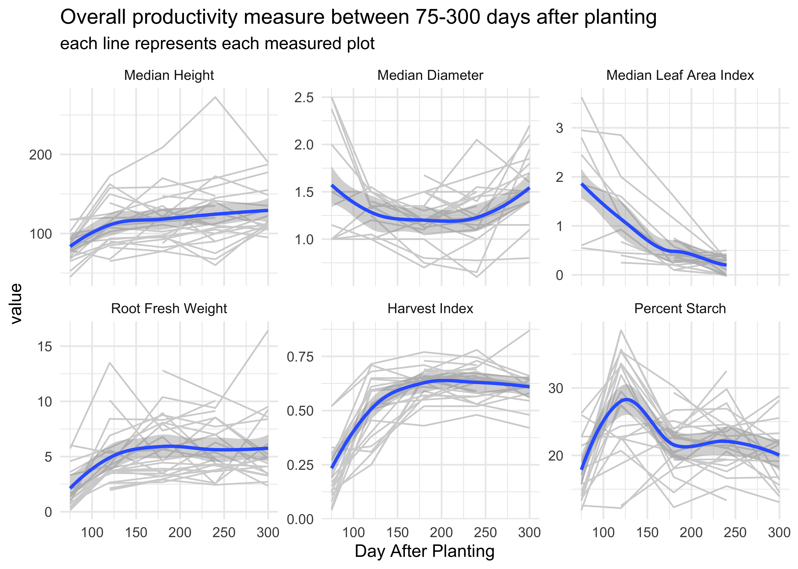
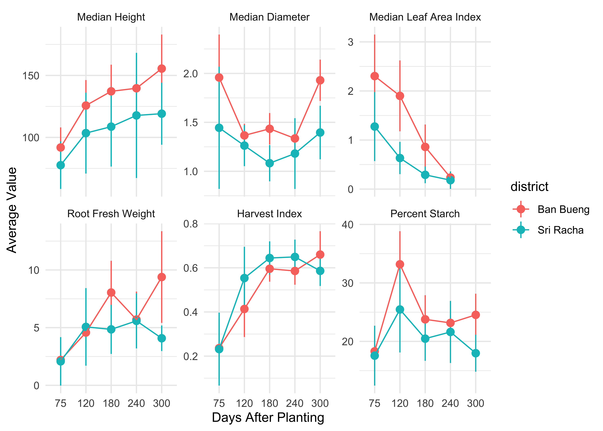
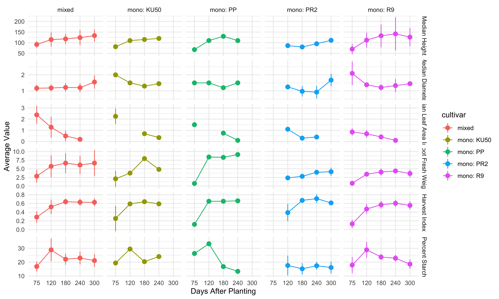
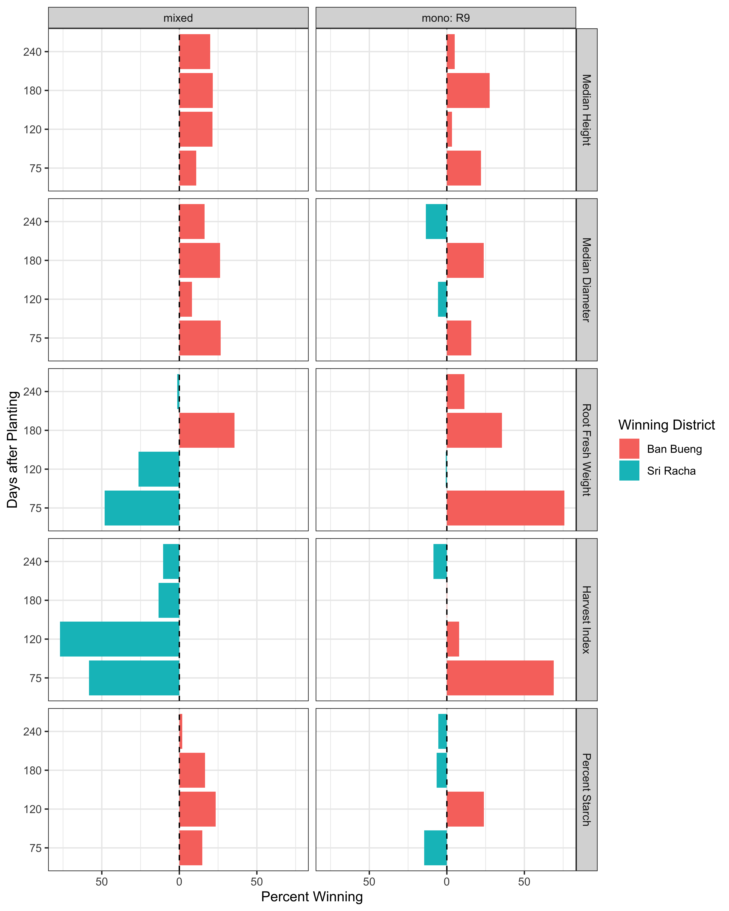

# Cassava Productivity Analysis
Ekaphan Kraichak

## วัตถุประสงค์ของการวิเคราะห์

การวิเคราะห์นี้ใช้ข้อมูลการเติบโต (growth) และผลผลิต (productivity)
ของมันสำปะหลังในช่วงเวลาปลูกตั้งแต่ 75 - 300 วัน ในพื้นที่ อ.บ้านบึง และ อ.ศรีราชา
จังหวัดชลบุรี ในช่วงปี พ.ศ. 2565-2566 (ค.ศ. 2022-23)
โดยจะเน้นการแสดงผลการเติบโตและผลผลิตตามเวลา พันธุ์ และ พื้นที่ปลูก ดังต่อไปนี้

## สถานที่ดำเนินการ

ข้อมูลติดตามการเจริญเติบโตของมันสำปะหลังเก็บที่บริเวณ อ.บ้านบึง และ อ.ศรีราชา
จังหวัดชลบุรี มีพิกัดกึ่งกลางอยู่ที่ 13.11803°N, 101.0746°E
โดยมีขนาดแปลงปลูกรวมแตกต่างกันออกไป

## ภาพรวมของข้อมูล

ภาพด้านล่างแสดงให้เห็นถึงแนวโน้มการเติบโตของ height, diameter, leaf area index
ที่ได้จากค่ามัธยฐาน (median) ของ 10 ต้นในแต่ละแปลงที่แต่ละระยะเวลาปลูก และ
ค่าผลผลิตของหัวมันสำปะหลังทั้งในรูปแบบ น้ำหนักสดของหัว (Root Fresh Weight)
ดัชนีเก็บเกี่ยว (Harvest Index) และ ร้อยละของแป้งภายในหัว (Percent Starch)

ตารางด้านล่างสรุปค่าเฉลี่ยของแต่ละแปลงในแต่ละช่วงเวลา

#### 1) Median Height

| plot |  DAP75 | DAP120 | DAP180 | DAP240 | DAP300 |
|:-----|-------:|-------:|-------:|-------:|-------:|
| B01  |  77.50 | 102.50 | 111.25 | 100.00 | 122.50 |
| B02  |  82.50 |     NA |     NA |     NA |     NA |
| B03  |  85.00 | 115.00 | 170.00 | 147.50 |     NA |
| B04  |  87.50 | 157.50 | 158.75 | 170.00 | 187.50 |
| B05  | 117.50 | 125.00 | 145.00 | 160.00 | 177.50 |
| B06  | 117.50 | 120.00 | 120.00 | 145.00 | 155.00 |
| B07  |     NA |     NA | 147.50 |     NA | 135.00 |
| B08  |  87.50 | 150.00 | 130.00 | 135.00 |    NaN |
| B09  |  80.00 | 110.00 | 115.00 | 120.00 |     NA |
| S01  |  92.50 |     NA | 135.00 |  90.00 |     NA |
| S02  |     NA | 138.75 | 115.00 | 140.00 | 105.00 |
| S03  |     NA |  90.00 |  82.50 |  90.00 | 110.00 |
| S04  |  65.00 |  85.00 |  92.50 | 107.50 | 110.00 |
| S05  |     NA |     NA |  87.50 | 145.00 |     NA |
| S06  |  67.50 | 110.00 | 130.00 | 110.00 |     NA |
| S07  |  45.00 |  93.75 |  96.25 | 105.00 |  95.00 |
| S08  |  52.50 |  93.75 |  95.00 |  75.00 | 110.00 |
| S09  |  70.00 |  87.50 |  97.50 |  60.00 | 115.00 |
| S10  |  78.75 |  67.50 | 122.50 | 110.00 | 105.00 |
| S11  | 102.50 | 172.50 | 208.75 | 272.50 | 190.00 |
| S12  |     NA |  82.50 |  77.50 | 100.00 | 112.50 |
| S13  |     NA |  65.00 |  77.50 |  67.50 | 107.50 |
| S14  |  92.50 | 162.50 | 121.25 | 172.50 | 148.75 |
| S15  |  87.50 |  92.50 |  97.50 | 126.25 | 110.00 |
| S16  | 100.00 | 107.50 | 102.50 | 112.50 | 130.00 |

#### 2) Median Leaf Area Index

| plot | DAP75 | DAP120 | DAP180 | DAP240 | DAP300 |
|:-----|------:|-------:|-------:|-------:|-------:|
| B01  | 1.550 |    NaN |  0.350 |  0.200 |    NaN |
| B02  | 1.750 |     NA |     NA |     NA |     NA |
| B03  | 1.150 |    NaN |  0.750 |  0.000 |     NA |
| B04  | 1.850 |  1.600 |  0.575 |  0.200 |    NaN |
| B05  | 3.625 |  2.000 |  1.150 |  0.300 |    NaN |
| B06  | 2.800 |  1.150 |  0.400 |  0.300 |    NaN |
| B07  |    NA |     NA |  1.350 |     NA |    NaN |
| B08  | 2.950 |  2.850 |  1.600 |  0.300 |    NaN |
| B09  | 2.750 |    NaN |  0.700 |  0.350 |     NA |
| S01  | 2.450 |     NA |  0.200 |  0.000 |     NA |
| S02  |    NA |    NaN |  0.450 |  0.225 |    NaN |
| S03  |    NA |  1.100 |  0.400 |  0.500 |    NaN |
| S04  | 1.100 |    NaN |  0.400 |  0.000 |    NaN |
| S05  |    NA |     NA |  0.300 |  0.200 |     NA |
| S06  | 1.500 |    NaN |  0.750 |  0.100 |     NA |
| S07  | 0.600 |  0.925 |  0.100 |  0.000 |    NaN |
| S08  | 0.550 |  0.450 |  0.400 |    NaN |    NaN |
| S09  |   NaN |  0.250 |  0.200 |  0.000 |    NaN |
| S10  |   NaN |  0.400 |  0.200 |  0.000 |    NaN |
| S11  |   NaN |    NaN |  0.400 |  0.400 |    NaN |
| S12  |    NA |    NaN |  0.200 |  0.300 |    NaN |
| S13  |    NA |    NaN |  0.200 |  0.300 |    NaN |
| S14  | 1.450 |    NaN |  0.100 |  0.300 |    NaN |
| S15  |   NaN |    NaN |  0.100 |  0.000 |    NaN |
| S16  |   NaN |  0.675 |  0.250 |  0.400 |    NaN |

#### 3) Median Diameter

| plot | DAP75 | DAP120 | DAP180 | DAP240 | DAP300 |
|:-----|------:|-------:|-------:|-------:|-------:|
| B01  | 1.500 |  1.275 |  1.150 |  1.450 |   1.70 |
| B02  |   NaN |     NA |     NA |     NA |     NA |
| B03  | 2.375 |  1.325 |  1.500 |  1.200 |     NA |
| B04  |   NaN |    NaN |  1.675 |  1.400 |   2.10 |
| B05  |   NaN |    NaN |  1.500 |  1.250 |   1.80 |
| B06  |   NaN |    NaN |  1.350 |  1.100 |   2.20 |
| B07  |    NA |     NA |  1.500 |     NA |   1.85 |
| B08  |   NaN |    NaN |  1.500 |  1.500 |    NaN |
| B09  | 2.000 |  1.500 |  1.300 |  1.450 |     NA |
| S01  |   NaN |     NA |  1.200 |  1.000 |     NA |
| S02  |    NA |  1.400 |  1.200 |  1.225 |   1.55 |
| S03  |    NA |    NaN |  1.200 |  1.200 |   1.40 |
| S04  |   NaN |    NaN |  1.050 |  1.100 |   1.40 |
| S05  |    NA |     NA |  1.200 |  1.350 |     NA |
| S06  | 1.500 |  1.500 |  1.200 |  1.500 |     NA |
| S07  | 2.500 |  1.500 |  1.125 |  1.200 |   1.40 |
| S08  | 2.500 |  1.350 |  1.050 |  1.100 |   1.40 |
| S09  | 1.150 |  1.000 |  0.700 |  1.000 |   1.40 |
| S10  | 1.000 |  1.000 |  1.200 |  1.150 |   1.15 |
| S11  | 1.000 |  1.350 |  1.350 |  2.050 |   1.60 |
| S12  |    NA |  1.250 |  0.750 |  0.650 |   1.95 |
| S13  |    NA |  1.000 |  1.000 |  0.600 |   1.10 |
| S14  | 1.000 |  1.200 |  1.100 |  1.550 |   1.50 |
| S15  | 1.000 |  1.050 |  0.800 |  0.775 |   0.80 |
| S16  | 1.350 |  1.550 |  1.200 |  1.450 |   1.50 |

#### 4) Harvest Index

| plot | DAP75 | DAP120 | DAP180 | DAP240 | DAP300 |
|:-----|------:|-------:|-------:|-------:|-------:|
| B01  |  0.15 |  0.525 |  0.550 |  0.565 |  0.610 |
| B02  |  0.46 |     NA |     NA |     NA |     NA |
| B03  |  0.29 |  0.505 |  0.570 |  0.565 |     NA |
| B04  |  0.17 |  0.380 |  0.555 |  0.630 |  0.610 |
| B05  |  0.33 |  0.310 |  0.590 |  0.530 |  0.640 |
| B06  |  0.31 |  0.335 |  0.520 |  0.520 |  0.580 |
| B07  |    NA |     NA |  0.690 |     NA |  0.650 |
| B08  |  0.13 |  0.250 |  0.650 |  0.700 |  0.870 |
| B09  |  0.05 |  0.590 |  0.640 |  0.590 |     NA |
| S01  |  0.19 |     NA |  0.680 |  0.690 |     NA |
| S02  |    NA |  0.645 |  0.630 |  0.730 |  0.640 |
| S03  |    NA |  0.250 |  0.660 |  0.640 |  0.620 |
| S04  |  0.11 |  0.300 |  0.560 |  0.655 |  0.620 |
| S05  |    NA |     NA |  0.730 |  0.710 |     NA |
| S06  |  0.12 |  0.650 |  0.650 |  0.660 |     NA |
| S07  |  0.04 |  0.510 |  0.645 |  0.640 |  0.620 |
| S08  |  0.08 |  0.595 |  0.640 |  0.680 |  0.560 |
| S09  |  0.27 |  0.610 |  0.655 |  0.580 |  0.610 |
| S10  |  0.27 |  0.710 |  0.630 |  0.650 |  0.620 |
| S11  |  0.13 |  0.455 |  0.430 |  0.480 |  0.420 |
| S12  |    NA |  0.530 |  0.680 |  0.780 |  0.605 |
| S13  |    NA |  0.510 |  0.630 |  0.530 |  0.480 |
| S14  |  0.52 |  0.680 |  0.710 |  0.640 |  0.620 |
| S15  |  0.52 |  0.715 |  0.770 |  0.745 |  0.660 |
| S16  |  0.30 |  0.590 |  0.610 |  0.580 |  0.545 |

#### 5) Root Fresh Weight

| plot | DAP75 | DAP120 | DAP180 | DAP240 | DAP300 |
|:-----|------:|-------:|-------:|-------:|-------:|
| B01  | 1.030 |  3.745 |  3.910 |  3.650 |  4.120 |
| B02  | 3.760 |     NA |     NA |     NA |     NA |
| B03  | 2.055 |  3.430 |  5.660 |  4.810 |     NA |
| B04  | 1.345 |  6.900 |  8.765 |  7.710 |  8.400 |
| B05  | 4.580 |  5.790 |  8.080 |  6.990 |  9.525 |
| B06  | 3.330 |  4.190 |  6.790 |  2.520 |  9.260 |
| B07  |    NA |     NA | 12.800 |     NA |  8.580 |
| B08  | 1.030 |  4.230 | 10.390 |  9.400 | 16.430 |
| B09  | 0.450 |  3.750 |  7.960 |  4.830 |     NA |
| S01  | 1.400 |     NA |  8.950 |  4.400 |     NA |
| S02  |    NA | 10.105 |  4.620 |  8.545 |  5.180 |
| S03  |    NA |  2.605 |  2.680 |  3.720 |  5.000 |
| S04  | 0.840 |  2.660 |  3.240 |  3.770 |  4.890 |
| S05  |    NA |     NA |  7.950 | 10.070 |     NA |
| S06  | 0.750 |  8.420 |  8.320 |  9.130 |     NA |
| S07  | 0.140 |  3.695 |  3.720 |  4.330 |  4.090 |
| S08  | 0.320 |  3.705 |  4.450 |  4.190 |  3.260 |
| S09  | 1.680 |  3.510 |  3.450 |  2.590 |  6.170 |
| S10  | 1.680 |  3.980 |  4.700 |  5.380 |  3.480 |
| S11  | 0.690 |  3.755 |  3.195 |  4.760 |  2.340 |
| S12  |    NA |  2.130 |  2.960 |  4.280 |  3.300 |
| S13  |    NA |  1.960 |  2.910 |  2.440 |  2.710 |
| S14  | 5.730 | 13.490 |  7.345 |  8.520 |  4.850 |
| S15  | 6.030 |  5.335 |  5.650 |  6.995 |  3.400 |
| S16  | 3.600 |  5.565 |  3.480 |  6.280 |  4.370 |

#### 6) Percent Starch

| plot |    DAP75 |   DAP120 |   DAP180 |   DAP240 |   DAP300 |
|:-----|---------:|---------:|---------:|---------:|---------:|
| B01  | 22.79984 | 22.76436 | 24.08910 | 24.58682 | 21.76645 |
| B02  | 20.53608 |       NA |       NA |       NA |       NA |
| B03  | 15.99749 | 35.69664 | 22.52699 | 21.87610 |       NA |
| B04  | 15.70905 | 38.52315 | 22.67093 | 21.05492 | 28.15896 |
| B05  | 17.10759 | 38.52315 | 22.92501 | 23.53151 | 28.80357 |
| B06  | 13.25765 | 31.90625 | 18.12514 | 24.21812 | 25.55714 |
| B07  |       NA |       NA | 29.29407 |       NA | 19.67341 |
| B08  | 22.74426 | 35.41223 | 30.21721 | 22.85153 | 23.29699 |
| B09  | 18.25820 | 29.48623 | 20.35673 | 24.03726 |       NA |
| S01  | 15.72163 |       NA | 22.81901 | 32.52150 |       NA |
| S02  |       NA | 35.36651 | 23.85723 | 29.82478 | 16.41024 |
| S03  |       NA | 12.54910 | 18.04989 | 19.36187 | 19.14383 |
| S04  | 26.01344 | 22.33243 | 26.71375 | 26.92385 | 21.91006 |
| S05  |       NA |       NA | 19.33617 | 19.44204 |       NA |
| S06  | 26.26700 | 33.25341 | 16.78829 | 13.34788 |       NA |
| S07  | 13.99857 | 33.63490 | 21.27620 | 21.52777 | 20.15719 |
| S08  | 11.88166 | 28.45163 | 22.94183 | 21.11169 | 18.25820 |
| S09  | 12.58281 | 12.19439 | 20.15327 | 17.62398 | 21.67058 |
| S10  | 14.74641 | 27.49071 | 19.76031 | 18.45355 | 22.23564 |
| S11  | 21.42481 | 24.34083 | 25.11190 | 22.76635 | 13.93774 |
| S12  |       NA | 22.66644 | 12.31849 | 15.45707 | 13.07916 |
| S13  |       NA | 27.36154 | 20.01251 | 16.62645 | 16.79097 |
| S14  | 19.05028 | 33.61108 | 23.35568 | 27.76122 | 14.46899 |
| S15  | 18.01107 | 20.69096 | 14.51442 | 20.59475 | 15.61316 |
| S16  | 13.52464 | 22.50987 | 20.57212 | 22.53448 | 20.12264 |

## ความแตกต่างของผลผลิตตามสถานที่ปลูก

ภาพด้านล่างแสดงให้เห็นถึงความแตกต่างการเติบโตและผลผลิตระหว่างแปลงในพื้นที่บ้านบึง กับ
ศรีราชา โดยแสดงให้เห็นว่า
ค่าการเติบโตและผลผลิตส่วนใหญ่จากแปลงที่บ้านบึง<u>สูงกว่า</u>แปลงที่ศรีราชา ยกเว้นแต่
Harvest Index เท่านั้น

## ความแตกต่างของผลผลิตตามพันธุ์ปลุก

ภาพด้านล่างแสดงให้เห็นถึงพันธุ์ปลูกไม่แตกต่างกันมากนักในเชิงการเติบโตและผลผลิตที่ได้
และมีแนวโน้มการเติบโตทางเวลาไปในทิศทางเดียวกัน

## ความสัมพันธ์ระหว่างพันธุ์ปลูกกับพื้นที่ปลูก

@area-by-cultivars แสดงให้เห็นว่าพื้นที่ปลูกมีผลต่อความสามารถของพันธุ์อีกด้วย

